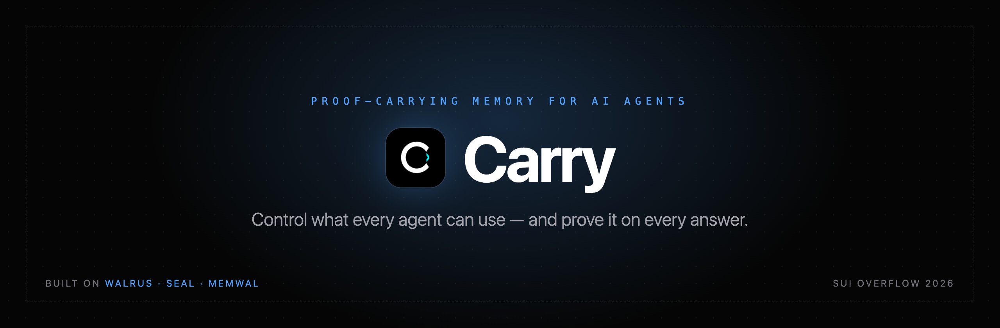
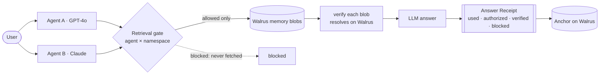
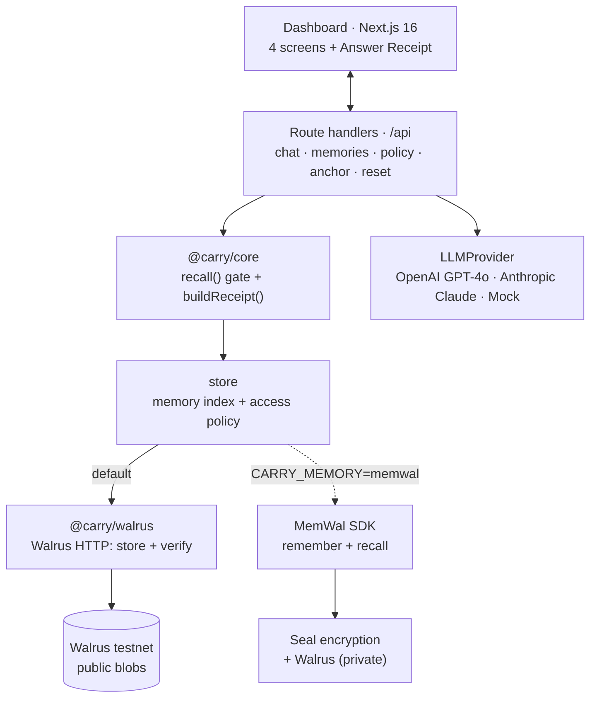

<div align="center">



&nbsp;

[](https://github.com/Enoch208/carry/actions/workflows/ci.yml)
[](LICENSE)
[](#tests)
[](https://www.walrus.xyz)
[](https://github.com/MystenLabs/MemWal)


### Proof-carrying memory for AI agents — control what every agent can use, and prove it on every answer.

Most AI-memory projects answer one question: _can an agent remember across sessions?_ Carry answers the harder one — **can you prove what an agent used to answer you, and stop it from touching memory it was never allowed to?** Every memory-based answer renders a verifiable **Answer Receipt** — the memories it used, whether each was authorized, whether the blob still resolves on Walrus, and the namespaces it was blocked from — and the access policy is enforced at _retrieval_, so the model physically never sees memory it isn't allowed to use. Built on **Walrus · Seal · MemWal** for **Sui Overflow 2026** (Walrus track).

**[ Watch the demo ↗ ](https://youtu.be/xnmx2WimhRk)** &nbsp;·&nbsp; **[ Live demo ↗ ](https://carrysui.vercel.app)** &nbsp;·&nbsp; **[ How it works ↗ ](#architecture)** &nbsp;·&nbsp; **[ Run it locally ↗ ](#run-it-locally)**

</div>

---

## ▶ Demo

[](https://youtu.be/xnmx2WimhRk)

_~3 minutes — the real app driven live (GPT-4o, Claude, Walrus testnet), plus the MCP server and on-chain enforcement. Try it yourself at **[carrysui.vercel.app](https://carrysui.vercel.app)**._

One fact is taught to **Agent A (GPT-4o)** and captured to Walrus as a real blob. **Agent B (Claude)** — a different provider — recalls it and answers, rendering an Answer Receipt that shows the exact memory used and verifies its blob on-chain. Then I revoke `agent-b`'s access to the `health` namespace, ask again, and watch the agent truthfully refuse — *"I cannot access your Health memory"* — because the gate ran **before** the model, and the revoked memory was never fetched. Finally I anchor the receipt on Walrus and get back a real, verifiable blob ID.

---

## Table of contents

- [The problem I set out to solve](#the-problem-i-set-out-to-solve)
- [What I built](#what-i-built)
- [Architecture](#architecture)
- [The recall loop, step by step](#the-recall-loop-step-by-step)
- [How I integrated Walrus, Seal & MemWal](#how-i-integrated-walrus-seal--memwal)
- [Use it from any agent (MCP)](#use-it-from-any-agent-mcp)
- [On-chain enforcement (Sui testnet)](#on-chain-enforcement-sui-testnet)
- [Engineering decisions & the hard problems](#engineering-decisions--the-hard-problems)
- [What's real vs mock — the honesty table](#whats-real-vs-mock--the-honesty-table)
- [The app](#the-app)
- [Tech stack](#tech-stack)
- [Project layout](#project-layout)
- [Run it locally](#run-it-locally)
- [How I'd deploy it](#how-id-deploy-it)
- [Tests](#tests)

---

## The problem I set out to solve

AI agents are getting persistent memory, and that's the easy half. The hard half is **trust**. When an agent answers "from memory," you have no way to know _which_ memory it used, whether it was _allowed_ to use it, or whether that memory even exists where it claims. Memory is locked to one app or model, it doesn't travel when you switch providers, and "the agent remembered" is something you take on faith.

That faith is the problem. An agent with access to a user's health, billing, and project memory — across multiple models — is one bad retrieval away from leaking something it should never have seen. "It probably used the right memory" is not good enough when the memory is sensitive and the agent acts on it.

So I treated **provenance and access as first-class**, not an afterthought. The non-negotiable design rule: **gate before generation.** Enforce the agent × namespace policy at _retrieval_ — the model only ever sees allowed memory — so the receipt under every answer is honest by construction, not a label slapped on after the fact.

## What I built

A memory layer for agents where every answer carries its proof:

1. **Teach** — Agent A captures facts into typed namespaces (`diet`, `health`, `project`, `billing`) as you chat. Each fact is written to **Walrus** as a blob; the real blob ID becomes the memory's reference.
2. **Gate** — when any agent recalls, an **agent × namespace policy** runs _before_ the model is called. Allowed namespaces are fetched; blocked ones are never touched. This logic is pure, framework-free, and unit-tested.
3. **Recall across models** — Agent A runs on **OpenAI GPT-4o**, Agent B on **Anthropic Claude**. Both share the same gated memory; the proof travels with the answer, not the vendor.
4. **Prove** — every memory-based answer renders an **Answer Receipt**: the memories used, the source agent, whether each was authorized, whether its blob still resolves on Walrus (a live check, not a flag), and the namespaces that were blocked by policy.
5. **Anchor** — the full receipt can be written to Walrus as its own blob for tamper-evident provenance.

The whole thing is **mock-first**: real OpenAI/Anthropic/Walrus adapters sit behind interfaces, and the system falls back to deterministic mocks when a key is absent — so it runs offline and a demo never hard-fails on a flaky testnet.

**A note on what's honest about the demo.** The three seed memories aren't fixtures — they're real Walrus testnet blobs I uploaded once with [`apps/web/scripts/seed-walrus.mjs`](apps/web/scripts/seed-walrus.mjs); you can resolve them on any testnet aggregator. New captures hit Walrus live. The cross-model answers are live GPT-4o and Claude calls. The revoke is a real policy flip that the gate honors before the model is invoked. The only thing I _don't_ persist across server restarts is the in-process memory index — and I say so plainly in [the honesty table](#whats-real-vs-mock--the-honesty-table) rather than pretend otherwise.

## Architecture



I designed the system around a few typed contracts in `@carry/core` — get the boundaries right and the rest composes:

| Contract | Role |
|---|---|
| `Memory` | A stored fact: `namespace`, `content`, `sourceAgent`, `walrusRef` (the real blob ID), `createdAt`. |
| `Policy` | `agent → namespace → boolean`. The single source of truth the gate reads before every recall. |
| `AnswerReceipt` | The product surface: `usedMemories` (each with `authorized` + `verified` + `walrusRef`), `blockedNamespaces`, `agentId`. |

The gate is enforced server-side in the route handler, before the LLM is ever called — so a blocked namespace can't reach the model even by accident.

## The recall loop, step by step

This is what `POST /api/chat` does, and every step assumes the model might be wrong about what it's allowed to see:

1. **Trigger** — an agent receives a query.
2. **Gate** — `recall(agentId, query, memories, policy)` returns only the memories in namespaces this agent is allowed to read, plus the list of namespaces that matched the query _but were blocked by policy_. Blocked content is never loaded into the prompt.
3. **Verify** — each allowed memory's Walrus blob is re-checked against the aggregator (`GET /v1/blobs/{id}`). "Verified" means the blob genuinely resolves on-chain — it is **not** a flag I set.
4. **Generate** — the gated memories (and only those) are passed to the agent's model. With no allowed memory, the agent truthfully says it can't access what it needs.
5. **Receipt** — `buildReceipt(...)` assembles the Answer Receipt: used memories with their authorization + verification status, the blocked namespaces, and the source agent.
6. **Anchor (optional)** — `POST /api/anchor` writes the receipt to Walrus and verifies the returned blob.

The contrast that sells it: revoke `agent-b × health`, ask the allergy question again, and step 2 returns zero memories + `blocked: ["health"]`. The model never sees the health memory, the answer is an honest refusal, and the receipt proves the block.

## How I integrated Walrus, Seal & MemWal

Every capability is wired through the real platform, not faked. Here's the system view:



### Walrus (the default memory backend)
`@carry/walrus` talks to the Walrus HTTP API directly: `PUT /v1/blobs?epochs=N` on the publisher to store a memory, and `GET /v1/blobs/{id}` on the aggregator to verify it. Captured memories become **public Walrus blobs**, which is deliberate — it means a receipt's "verified" badge is an independent aggregator GET _anyone_ can repeat. That public verifiability is the strongest version of the proof story.

### MemWal — Walrus Memory (the Seal-encrypted mode)
Set `CARRY_MEMORY=memwal` and captures route through the **MemWal SDK** (`@mysten-incubation/memwal`) instead. `remember(text, namespace)` returns a background job; I `waitForRememberJob(...)` and store the returned Walrus `blob_id`. The MemWal relayer does the **Seal encryption, embedding, and Walrus storage server-side**, so memories become _private_ — addressed by a real Walrus blob but readable only through the relayer with the delegate key. I validated the full `remember → blob_id → recall` round-trip live against `relayer.memory.walrus.xyz` ([`apps/web/scripts/memwal-smoke.mjs`](apps/web/scripts/memwal-smoke.mjs)).

The trade-off is real and I designed around it: **public Walrus = independently verifiable receipts; MemWal = Seal-encrypted privacy.** Default stays public so the receipt stays publicly provable; MemWal is the opt-in privacy mode.

### Seal
Carry doesn't hand-roll encryption — it gets **Seal** through MemWal's server-side pipeline. In MemWal mode, every captured memory is Seal-encrypted before it lands on Walrus.

### Cross-model (one interface, two providers)
Both agents implement a single `LLMProvider` interface. Agent A is `OpenAIProvider` (GPT-4o), Agent B is `AnthropicProvider` (Claude); a `MockLLM` is the offline fallback. The agent loop doesn't know or care which model it's driving — which is exactly what lets the same gated memory answer through either provider.

## Use it from any agent (MCP)

The gate and receipts aren't locked inside the demo UI. Carry ships an **MCP server** (`@carry/mcp`) so any Model Context Protocol client — **Cursor, Claude Code, Claude Desktop** — gets gated, receipted, Walrus-verified memory that persists across sessions. Five tools:

| Tool | What it does |
|---|---|
| `carry_remember` | Store a fact → written to **Walrus** as a blob; returns the real ref |
| `carry_recall` | Retrieve relevant memory **gated before retrieval**, with an **Answer Receipt** — used · verified-on-Walrus · blocked namespaces |
| `carry_set_access` | Grant/revoke a namespace — a revoked namespace is never returned |
| `carry_list_memories` | List every memory + its Walrus ref |
| `carry_policy` | Show the allow/deny policy |

Point your agent at it (memory index persists on disk, content on Walrus):

```json
{
  "mcpServers": {
    "carry": {
      "command": "node",
      "args": ["--import", "tsx", "/ABSOLUTE/PATH/carry/packages/carry-mcp/src/index.ts"],
      "env": {
        "WALRUS_PUBLISHER": "https://publisher.walrus-testnet.walrus.space",
        "WALRUS_AGGREGATOR": "https://aggregator.walrus-testnet.walrus.space"
      }
    }
  }
}
```

So `carry_recall` returns not just memories but **proof of what was used and what was blocked** — and revoking a namespace means the agent truthfully can't reach it, because the gate runs *before* retrieval. Verified live over stdio ([`packages/carry-mcp/test/client.mjs`](packages/carry-mcp/test/client.mjs)): remember → recall (verified) → revoke → recall returns `0 used, 1 blocked`.

## On-chain enforcement (Sui testnet)

The gate and the receipt verdict aren't only server logic — they're a deployed Move package, `carry::access`. Granting or revoking a namespace is a **Sui transaction**, and `anchor_receipt` makes the **chain recompute** whether every used namespace was actually allowed for the agent. So a receipt physically cannot claim "authorized" for a namespace the policy revoked — consensus decides the verdict, not my server.

| Object | Sui testnet |
| --- | --- |
| Package `carry::access` | [`0xf3b458be…064d3`](https://suiscan.xyz/testnet/object/0xf3b458bea7002d364d6b6101dbdadb63a314cd529b2e2a576a6ab03a45c064d3) |
| `AccessPolicy` (shared) | [`0x1636920d…5edfb`](https://suiscan.xyz/testnet/object/0x1636920dbdacff4d2c6be0a3c2344c74308de24e5df89e194d6fceffe1e5edfb) |

Proven live — revoke `health` for `agent-b`, then anchor two receipts:

- **anchor #1** uses `diet` → `all_authorized: true` · [tx](https://suiscan.xyz/testnet/tx/FLETh8MAARu6tNmGh7ZjHWEwEQngChp1B1HehEpKfQSa)
- **anchor #2** falsely claims the revoked `health` → `all_authorized: false` — **the chain caught it** · [tx](https://suiscan.xyz/testnet/tx/5KUFn1mQiCDWVjDT9ZEHzk3fZyN7MB8mdK2sTMAUipFB)

Reproduce it yourself:

```bash
sui move test --path contracts      # gate logic, unit-tested
sui client publish contracts        # deploy; then call create / set_access / anchor_receipt
```

Live object IDs and the proof transactions are in [`deployments/testnet.json`](deployments/testnet.json).

## Engineering decisions & the hard problems

A few things I'm proud of, and the bugs that taught me something:

- **Gate before generation — the one rule everything else serves.** Access is enforced at retrieval, in `@carry/core`, before any model call. I never fetch everything and label some of it "unauthorized" after the fact; the model only ever receives allowed memory, so the receipt is honest by construction.
- **"Verified" had to mean something.** An earlier version marked every used memory `verified` by tautology. I rewrote the chat route to do a real aggregator `GET` on each used blob, in parallel, and derive `verified` from whether it actually resolves — so the green badge is on-chain truth, not decoration.
- **`@carry/core` is a framework-free engine, not app glue.** The gate, policy, and receipt logic live in a dependency-free package the Next app imports _and_ a 50-line [example](examples/agent-memory.ts) drives directly against live Walrus. That's the "developer tooling" half of the project — the proof it's reusable, not a one-off UI.
- **The ESM export bug — my favorite catch.** After extracting `@carry/core` / `@carry/walrus` into workspace packages, importing them from a plain Node script surfaced `{ default, module.exports }` — the named exports had vanished. The packages had no `"type": "module"`, so `tsx` transpiled the `export *` barrels as CommonJS and the named exports collapsed through interop. The Next build never showed it (Turbopack does full ESM transpilation), so it was a latent trap that only bit the SDK consumers. Marking the packages ESM fixed it cleanly.
- **Hydration-safe receipt history.** The dashboard reads receipts from `localStorage`. A naive `useState` read caused a hydration mismatch; a `useSyncExternalStore` with a cached snapshot caused a render loop ("getSnapshot should be cached"). The fix was a module-level cache keyed on the raw `localStorage` string plus a stable empty constant.
- **Real, reproducible Walrus seeds.** The demo memories are uploaded once with a committed script and their real blob IDs are baked into the seed — so they're genuinely resolvable on-chain with zero runtime cost, instead of fake hashes that would fail the very verification the product is about.
- **Mock-first, env-driven.** Every external dependency sits behind an interface with a mock implementation, selected by the presence of env keys. The app runs fully offline, and a flaky testnet during a live demo degrades gracefully instead of failing the pitch.

## What's real vs mock — the honesty table

| Capability | How it's backed |
|---|---|
| **Cross-model answers** | Live OpenAI **GPT-4o** (Agent A) + Anthropic **Claude** (Agent B); deterministic `MockLLM` fallback if a key is absent. |
| **Memory storage** | Real **Walrus testnet** blobs via the publisher; the three seed memories are real blobs you can resolve on any aggregator. |
| **"Verified" badge** | A live aggregator `GET` on each used memory's blob — not a flag. |
| **Gate / access policy** | Enforced in `@carry/core` _before_ the model call; revoked namespaces are never fetched. |
| **Seal encryption** | Real, server-side, via **MemWal mode** (`CARRY_MEMORY=memwal`); default mode stores public blobs. |
| **Receipt anchoring** | Real Walrus blob (`PUT`) + verify (`GET`). |
| **Demo memory index** | In-process (resets on restart) — an honest limitation. Durable, shared persistence (MemWal / KV) is the next step. |

End-to-end verified live: capture → cross-model recall → revoke → honest refusal → anchor, all against real GPT-4o, Claude, and Walrus testnet.

## The app

Four screens, all sharing one near-black, hairline-bordered design system; the **Answer Receipt** is the focal component everywhere it appears.

- **Chat A (writer)** — talk to GPT-4o, capture facts into namespaces; each capture shows its real Walrus blob ID.
- **Chat B (reader)** — talk to Claude over the _same_ gated memory; where live revoke is demonstrated.
- **Dashboard** — memory cards with provenance, Answer Receipt history, and the **Anchor on Walrus** action.
- **Access** — the agent × namespace matrix that flips the retrieval gate in real time.

The landing page is a faithful port of a premium "deep-tech" template, recolored to Sui blue.

## Tech stack

- **App:** Next.js 16 (App Router, Turbopack), React 19, TypeScript (strict), Tailwind CSS v4.
- **Engine:** `@carry/core` (gate · policy · receipts, dependency-free) + `@carry/walrus` (Walrus HTTP adapters), as npm workspaces.
- **Storage & privacy:** Walrus testnet (HTTP API); Seal + embeddings via MemWal (Walrus Memory) in `memwal` mode.
- **Models:** OpenAI GPT-4o + Anthropic Claude, behind one `LLMProvider` interface.
- **Tests:** Vitest — 13 tests across 3 workspaces.

## Project layout

```
apps/web/                     # Next.js 16 app
  app/
    (app)/{chat-a,chat-b,dashboard,access}/   # the four screens
    api/{chat,memories,policy,anchor,reset}/  # route handlers — the gate runs here
    layout.tsx · page.tsx · globals.css       # design system lives in globals.css
  components/
    landing/                  # faithful premium landing port
    app/                      # Chat · CaptureForm · ReceiptPanel · Dashboard · AccessMatrix · MemoryCard · AnchorButton · Sidebar
    ui/ · icons/              # primitives + HugeIcons wrapper
  lib/
    store.ts                  # in-memory index + backend selection (Walrus | MemWal | mock)
    llm.ts · llm-providers.ts # LLMProvider interface + OpenAI / Anthropic / Mock
    memwal.ts                 # MemWal client (dynamic import, behind CARRY_MEMORY flag)
    adapters.ts · agents.ts · api.ts · cn.ts
  scripts/
    seed-walrus.mjs           # one-time: upload demo memories to Walrus (real blob IDs)
    memwal-smoke.mjs          # validate MemWal remember/recall live
packages/
  carry-core/                 # @carry/core — types · access policy · gate (recall) · Answer Receipts. Pure, tested.
  carry-walrus/               # @carry/walrus — Walrus store/verify HTTP adapters + mock.
  carry-mcp/                  # @carry/mcp — MCP server: gated, receipted memory tools for any agent (Cursor / Claude Code)
examples/
  agent-memory.ts             # runnable: teach → gate → Walrus verify → receipt, no UI.
contracts/                    # Sui Move package carry::access — on-chain agent×namespace gate + receipt anchoring (+ tests)
deployments/testnet.json      # live Package ID + AccessPolicy / OwnerCap object IDs
docs/DEMO.md                  # 90-second demo script
```

## Run it locally

**Prerequisites:** Node 20+.

```bash
npm install            # installs all workspaces

# apps/web/.env.local — omit any pair to fall back to mock for that capability:
#   WALRUS_PUBLISHER=...    WALRUS_AGGREGATOR=...
#   OPENAI_API_KEY=...      ANTHROPIC_API_KEY=...
#
#   # optional — Seal-encrypted MemWal mode:
#   CARRY_MEMORY=memwal
#   MEMWAL_ACCOUNT_ID=...   MEMWAL_SERVER_URL=https://relayer.memory.walrus.xyz   MEMWAL_PRIVATE_KEY=...

npm run dev            # http://localhost:3000
npm test               # 13 tests across the 3 workspaces
npm run build          # production build

# upload the demo memories to Walrus (prints real blob IDs):
node --env-file=apps/web/.env.local apps/web/scripts/seed-walrus.mjs

# run the standalone SDK example against live Walrus:
npm run start -w @carry/example
```

Without any keys, Carry runs end-to-end in **mock mode** — no network, same UX.

## How I'd deploy it

Import the repo into **Vercel**, set the **Root Directory** to `apps/web` (Vercel detects the npm workspace and installs from the repo root, so `@carry/core` and `@carry/walrus` resolve), and add the four Walrus/OpenAI/Anthropic env vars (plus the MemWal vars to enable Seal mode). Framework preset and build command are auto-detected (Next.js / `next build`).

The demo memory index is in-process, so for the most reliable live-revoke demo I run locally; durable shared persistence (MemWal-backed) is the next step.

## Tests

```bash
npm test    # 13 passing across @carry/web, @carry/core, @carry/walrus
```

The suite covers the access policy, the gate (`recall` — including that blocked namespaces are never returned), the receipt builder, the mock Walrus client, and the mock LLM's refuse-vs-recall behavior. Beyond unit tests, I verified the full flow end-to-end against a **live** stack — capture → cross-model recall → revoke → honest refusal → anchor — with real GPT-4o, Claude, and Walrus testnet.
