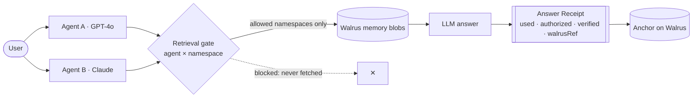

<div align="center">

# Carry

### Proof-carrying memory for AI agents

Agents share memory across models — and every memory-based answer renders a verifiable **Answer Receipt**: what memory was used, whether the agent was allowed to use it, and where it lives on Walrus.

**Built on Walrus · Seal · MemWal** — for **Sui Overflow 2026** (Walrus track)

</div>

---

## The problem

AI agent memory today is siloed, opaque, and unverifiable. It's locked to one app or model, it doesn't travel when you switch providers, and when an agent answers "from memory" you have no way to know *which* memory it used — or whether it was ever allowed to use it. As agents become long-running and multi-agent, that's a trust problem, not just a UX one.

## What Carry does

- **Gate before generation.** Access is enforced at *retrieval*. The agent × namespace policy decides what an agent can recall, so the model only ever sees memory it's allowed to use.
- **Answer Receipts.** Every memory-based answer carries a structured receipt: the memories used, the source agent, whether each was authorized, whether its blob still resolves on Walrus, and the namespaces that were blocked.
- **Cross-model.** Teach Agent A (GPT-4o); recall from Agent B (Claude). Memory follows the user, not the vendor.
- **Walrus-anchored.** Memory is written to Walrus as blobs; receipts can be anchored on Walrus too — tamper-evident provenance.

The one non-negotiable rule: **gate before generation.** We never fetch everything and label some of it "unauthorized" after the fact — the model only ever receives allowed memory, so the receipt is honest by construction.

## It's real, not a mock

The demo's seed memories are live Walrus **testnet** blobs. Resolve them yourself:

| Memory | Namespace | Walrus blob |
| --- | --- | --- |
| `Allergic to penicillin` | health | [oHJRrapc…ylVs](https://aggregator.walrus-testnet.walrus.space/v1/blobs/oHJRrapc1dfUR-IEuS1RO2xQZnGsPx8iFE12MXSylVs) |
| `Prefers vegan meals` | diet | [48oFqb9r…JoU](https://aggregator.walrus-testnet.walrus.space/v1/blobs/48oFqb9rDKoWi0-ynJbp9cFnerTCL6EhEQ9WFrvmJoU) |
| `Building Carry` | project | [3-2wNAGA…kd0](https://aggregator.walrus-testnet.walrus.space/v1/blobs/3-2wNAGA0-jb9sMMOpvl6IOiSJY-ILf5HsfiLEf5kd0) |

When you capture a new memory it's `PUT` to Walrus and the real blob ID is stored as its ref. Each Answer Receipt then re-checks that the blob still resolves before marking a memory "verified" — the badge is on-chain truth, not decoration.

## Architecture



## Monorepo

| Workspace | What it is |
| --- | --- |
| `apps/web` | Next.js 16 app — Chat A (writer), Chat B (reader), Dashboard, Access matrix. |
| `packages/carry-core` | `@carry/core` — the verifiable-memory engine: gate, access policy, Answer Receipts. Framework-free, dependency-free. |
| `packages/carry-walrus` | `@carry/walrus` — store and verify memory blobs over the Walrus HTTP API. |
| `examples` | Runnable SDK demo driving the engine against live Walrus. |

## Quickstart

```bash
npm install            # installs all workspaces

# apps/web/.env.local — real mode (omit any pair to fall back to mock):
#   WALRUS_PUBLISHER=...   WALRUS_AGGREGATOR=...
#   OPENAI_API_KEY=...     ANTHROPIC_API_KEY=...

npm run dev            # http://localhost:3000
npm test               # every workspace's tests
npm run build          # production build
```

Re-seed the demo memories onto Walrus (prints real blob IDs):

```bash
node --env-file=apps/web/.env.local apps/web/scripts/seed-walrus.mjs
```

Without keys, Carry runs end-to-end in **mock mode** — no network, same UX.

## The demo (≈90 seconds)

1. **Teach** — In **Chat A** (GPT-4o), capture `Allergic to penicillin` → stored on Walrus, real blob ID shown.
2. **Cross-model recall** — In **Chat B** (Claude), ask *"Am I allergic to anything?"* → it answers from the same memory; the receipt shows the blob, verified.
3. **Live revoke** — In **Access**, flip `agent-b × health` off. Ask again → *"I cannot access your Health memory"* with `health blocked by policy`. Nothing leaks — the gate never fetched it.
4. **Anchor** — On the **Dashboard**, anchor the receipt on Walrus → real blob ID, verified.

## Roadmap

- **Now** — gate-before-generation, Answer Receipts, memory written to & verified on Walrus, cross-model GPT-4o ↔ Claude.
- **Next** — [MemWal](https://github.com/MystenLabs/MemWal) (Walrus Memory) as the memory layer, Seal per-agent encryption, anchor-by-default, full audit log.
- **Vision** — multi-agent coordination, a drop-in adapter SDK, mainnet.

## Stack

Next.js 16 · React 19 · TypeScript (strict) · Tailwind CSS v4 · npm workspaces · Walrus testnet (HTTP API) · OpenAI + Anthropic.
