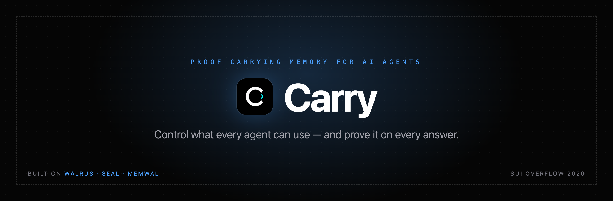
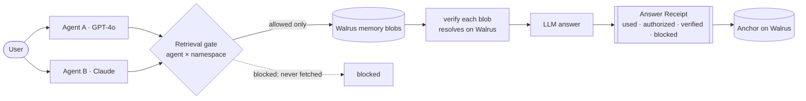
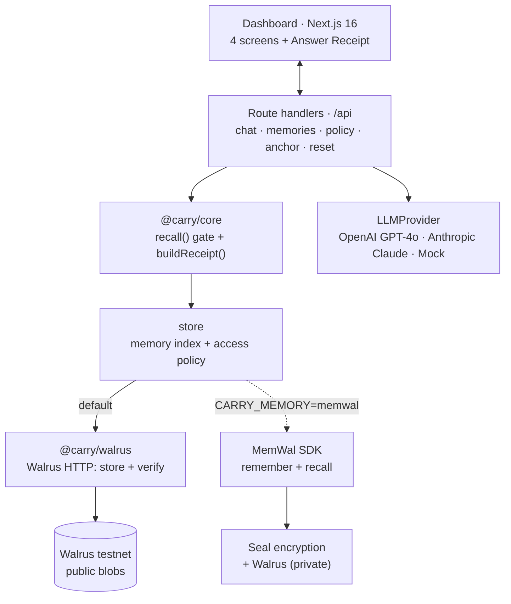

<div align="center">



&nbsp;

[](https://github.com/Enoch208/carry/actions/workflows/ci.yml)
[](LICENSE)
[](#tests)
[](https://www.npmjs.com/package/@usecarry/cli)
[](https://www.npmjs.com/package/@usecarry/mcp)
[](https://docs.usecarry.xyz)
[](https://suiscan.xyz/mainnet/object/0xeaf4e6e4e96e4f50dfcf2f4beebe3bacb766ad6cbf352b0982bd9631884032d8)
[](https://www.walrus.xyz)
[](https://github.com/MystenLabs/MemWal)


### Proof-carrying memory for AI agents — control what every agent can use, and prove it on every answer.

Most AI-memory projects answer one question: _can an agent remember across sessions?_ Carry answers the harder one — **can you prove what an agent used to answer you, and stop it from touching memory it was never allowed to?** Every memory-based answer renders a verifiable **Answer Receipt** — the memories it used, whether each was authorized, whether the blob still resolves on Walrus, and the namespaces it was blocked from — and the access policy is enforced at _retrieval_, so the model physically never sees memory it isn't allowed to use. Built on **Walrus · Seal · MemWal** for **Sui Overflow 2026** (Walrus track).

**[ Live app ↗ ](https://usecarry.xyz)** &nbsp;·&nbsp; **[ Docs ↗ ](https://docs.usecarry.xyz)** &nbsp;·&nbsp; **[ Watch the demo ↗ ](https://youtu.be/xnmx2WimhRk)** &nbsp;·&nbsp; **[ How it works ↗ ](#architecture)** &nbsp;·&nbsp; **[ Run it locally ↗ ](#run-it-locally)**

</div>

---

## ▶ Demo

https://github.com/user-attachments/assets/3bf417d7-0519-4bfe-a6cd-d43488ee29f8

_~3 minutes — the real app driven live (GPT-4o, Claude, Walrus testnet), plus the MCP server and on-chain enforcement. Also on [YouTube](https://youtu.be/xnmx2WimhRk) · try it live at **[usecarry.xyz](https://usecarry.xyz)**._

One fact is taught to **Agent A (GPT-4o)** and captured to Walrus as a real blob. **Agent B (Claude)** — a different provider — recalls it and answers, rendering an Answer Receipt that shows the exact memory used and verifies its blob on-chain. Then I revoke `agent-b`'s access to the `health` namespace, ask again, and watch the agent truthfully refuse — *"I cannot access your Health memory"* — because the gate ran **before** the model, and the revoked memory was never fetched. Finally I anchor the receipt on Walrus and get back a real, verifiable blob ID.

---

## Proof — nothing here is a mockup

Everything below is live right now. Click it.

**Live app.** [usecarry.xyz](https://usecarry.xyz) — the four Carry screens, plus **[Aria](https://usecarry.xyz/companion)**, a health companion that only remembers what you allow and proves it on every reply.

**Technical docs.** [docs.usecarry.xyz](https://docs.usecarry.xyz) — 20+ pages: architecture, the gate, Answer Receipts, the Move contract, the hash chain, the walletless verifier, and integration guides for the CLI, MCP, and AI SDK.

**On Sui mainnet.** The gate is a deployed Move package. Anchoring an answer mints a tamper-evident **`Receipt` proof object**: `anchor_receipt` recomputes the verdict on-chain, binds the proof to the exact Walrus blob via blake2b256, and links it into an append-only hash chain. **Verify any proof yourself, no wallet:**

- 🔎 **[Verify a live proof ↗](https://usecarry.xyz/verify/0x1d9f44e0b8599b199f3b313775a3a639e7d96f012d0dd01996a34c80816376b8?network=mainnet)** — reads the object from Sui, re-hashes the Walrus blob, recomputes the verdict, and confirms the policy has not moved since. All four checks green.
- 🔎 **[Verify the receipt that lies ↗](https://usecarry.xyz/verify/0x54a6bb1e1681a6f15c815893a356c220e8828dd3e393437d8aaebc0f9182d95d?network=mainnet)** — an *authentic* proof whose recorded verdict is a refusal. It verifies, and what it certifies is that the agent was blocked.
- Package `carry::access` → [`0xeaf4e6e4…4032d8`](https://suiscan.xyz/mainnet/object/0xeaf4e6e4e96e4f50dfcf2f4beebe3bacb766ad6cbf352b0982bd9631884032d8)
- Honest anchor (`health`) → `all_authorized: true` → [tx `6SF3GFom…`](https://suiscan.xyz/mainnet/tx/6SF3GFomdYirhXQ5RY674TaRgqWvyyWfP8MiM6JPDpbb)
- A receipt that lies (claims the revoked `billing`) → `all_authorized: false` — **the chain caught it** → [tx `96SAp82K…`](https://suiscan.xyz/mainnet/tx/96SAp82KZq9dW5qM2hBH7vaYfKaKfXMFXorv5bogNiLV)

Also deployed on **testnet** ([`0xf7acc10e…98b6f9`](https://suiscan.xyz/testnet/object/0xf7acc10ee3de95ed5bb4560e48d5bf4a4e24f7c4003b892b56632c7ff398b6f9)); every ID and proof transaction for both networks is in [`deployments/`](deployments).

**On Walrus mainnet.** The anchored receipt is a real blob, stored for 53 epochs (~2 years) and resolvable by anyone:

- Answer Receipt → [aggregator GET ↗](https://aggregator.walrus-mainnet.walrus.space/v1/blobs/VftF9eLPMTYNfQ1zmsojrKVRhAQffftTBT2Kc1gWxTo) — re-hashes to the digest anchored on Sui

**On Walrus testnet.** The seed memories aren't fixtures — they're real blobs anyone can resolve:

- `health · "Allergic to penicillin"` → [aggregator GET ↗](https://aggregator.walrus-testnet.walrus.space/v1/blobs/oHJRrapc1dfUR-IEuS1RO2xQZnGsPx8iFE12MXSylVs)
- `health · "Gets migraines…"` → [GET ↗](https://aggregator.walrus-testnet.walrus.space/v1/blobs/teb6wF9Ypzec4x3CPbleffMyQfWog0I1RLGPwsqcDUY)
- `diet · "Prefers vegan meals"` → [GET ↗](https://aggregator.walrus-testnet.walrus.space/v1/blobs/48oFqb9rDKoWi0-ynJbp9cFnerTCL6EhEQ9WFrvmJoU)

**Check it yourself, no wallet.** Four pages that hold no state and read only from Sui and Walrus:

| | |
| --- | --- |
| [**/lab**](https://usecarry.xyz/lab?network=mainnet) | ten attacks run live against the on-chain gate — and the same probes against the previous, fail-open package for comparison |
| [**/vault**](https://usecarry.xyz/vault?network=mainnet) | a memory vault rebuilt from chain and Walrus alone, which is what a second device sees |
| [**/metrics**](https://usecarry.xyz/metrics) | receipt totals from each policy's own on-chain counter, with every Walrus blob re-fetched |
| [**/enterprise**](https://usecarry.xyz/enterprise?network=mainnet) | a support desk where four agents' reach is enforced by the contract, not a prompt |
| [**/pricing**](https://usecarry.xyz/pricing) | the commercial model, and a plain list of what is and is not built |

**In your terminal.** `carry` — proof-carrying memory as a CLI ([`@usecarry/cli`](packages/carry-cli), sharing one on-disk vault with the MCP server):

```bash
carry seed
carry recall "am I allergic to anything?"    # → Answer Receipt, each blob verified on Walrus
carry access revoke health
carry recall "am I allergic to anything?"    # → 1 namespace blocked · your data never reached the model
carry anchor --onchain                       # → submits a real Sui tx; consensus recomputes all_authorized
carry anchor --onchain --claim billing       # → all_authorized: false — the chain catches the lie, live
```

**For any agent.** An **MCP server** ([`@usecarry/mcp`](packages/carry-mcp)) gives Cursor / Claude Code / Claude Desktop the same gated, receipted memory; a **Vercel AI SDK adapter** ([`@usecarry/vercel-ai`](packages/carry-vercel-ai)) wraps any model in one line — gated memory before generation, a receipt on every call.

**Tested.** 16 TypeScript tests (gate · policy · receipts · Walrus) + Move unit tests for `carry::access`. Green in [CI](../../actions).

---

## Built after Demo Day

Everything below shipped after the hackathon demo. Each row links to the commit, the
mainnet transaction it produced, and a page you can check yourself — no screenshots.

| Date | Milestone | Evidence |
| --- | --- | --- |
| 2026-07-31 | **`carry::access` live on Sui mainnet.** The gate is no longer testnet-only. | [commit](https://github.com/Enoch208/carry/commit/fb30208) · [publish tx](https://suiscan.xyz/mainnet/tx/9oeU6kv8AWkCGQVQ2CALigfTYh9t7DgBUo5o27dieZrh) · [package](https://suiscan.xyz/mainnet/object/0x77bf6a36c2236579f084d7c66ad16b3da3277982d958e43f3d716c81ebe43f61) |
| 2026-07-31 | **Policy created and the gate enforced on-chain** — `aria` revoked from `billing`, so a receipt claiming it is caught by consensus. | [create tx](https://suiscan.xyz/mainnet/tx/FijWHLi9Va77HjuTR3EPgnJmMWhmNuHw665bmJi4tqWa) · [revoke tx](https://suiscan.xyz/mainnet/tx/6qNBNrb4TAYwNqdbRJi6cbjdESjqfLidyHiKhau1paB3) |
| 2026-07-31 | **Sui reads migrated to gRPC.** Public fullnodes retired legacy JSON-RPC on this date; reads now go to the canonical fullnodes instead of third-party mirrors still serving the dead protocol. | [commit](https://github.com/Enoch208/carry/commit/5074b3f) |
| 2026-07-31 | **Walletless verifier is dual-network** — `?network=mainnet` resolves against mainnet, and an id is only honoured on a network where the package is actually deployed. | [commit](https://github.com/Enoch208/carry/commit/fb30208) · [verifier](https://usecarry.xyz/verify/0x70a997c909dbe0c0018e4de971a3d4a29287b788d9991de2964461ed2e713cdf?network=mainnet) |
| 2026-07-31 | **Answer Receipt stored on Walrus mainnet** for 53 epochs (~2 years). Mainnet has no public publisher by design, so blobs are written with the `walrus` CLI paying WAL from the project wallet. | [blob ↗](https://aggregator.walrus-mainnet.walrus.space/v1/blobs/VftF9eLPMTYNfQ1zmsojrKVRhAQffftTBT2Kc1gWxTo) · [blob object](https://suiscan.xyz/mainnet/object/0x619d7b698e82a760d3aaa956e83db313cee8d7f91b251a789db72df1057c3bba) |
| 2026-07-31 | **Mainnet proofs anchored — all three checks green.** One honest, one claiming the revoked namespace. The second verifies as an *authentic* receipt whose recorded verdict is a refusal. | [honest tx](https://suiscan.xyz/mainnet/tx/38dBeih1MQErs4iMDETzbsh9YoDf7gxECPW8HQ8jZWbR) · [blocked tx](https://suiscan.xyz/mainnet/tx/8NUwAKdPf7cBiuhxtzF7eBT285jdci392arZQ3MHp23R) · [verify ↗](https://usecarry.xyz/verify/0xe888f0e38ee1c8ab8b4bb917a6d5902356a9464fb73d5511ec5d16b2d1fd03b7?network=mainnet) |
| 2026-07-31 | **CLI and MCP are network-aware.** `CARRY_NETWORK` selects package, policy and aggregator; anchoring refuses to run when the Sui CLI's active env disagrees with the target chain. | [commit](https://github.com/Enoch208/carry/commit/4046f18) |
| 2026-07-31 | **Two reliability fixes found while hardening.** A Walrus outage could hang `carry anchor` indefinitely and stop it ever reaching the chain; anchored receipts were stored for Walrus's default 5 epochs, which silently expires `/verify` links within days. | [outage fix](https://github.com/Enoch208/carry/commit/cdae85a) · [epochs fix](https://github.com/Enoch208/carry/commit/121b755) |

| 2026-07-31 | **A support desk, gated on-chain.** Four agents across six namespaces on mainnet: the FAQ agent cannot reach billing, the refund agent works invoices but never customer records, and `admin` is granted to nobody — every cell read live rather than rendered from a fixture. | [/enterprise ↗](https://usecarry.xyz/enterprise?network=mainnet) |
| 2026-07-31 | **A threat model that names what is not defended** — OwnerCap concentration, prompt injection inside stored memory, receipt coverage being a deployment property, and correlation from public receipts. | [threat-model.md](docs/threat-model.md) |
| 2026-07-31 | **Sealed Answer Receipts.** A proof is public, so the blob it binds to must not carry the memory. Sealed receipts keep agent, namespaces, verdict and policy version in the clear and replace query, answer and memory contents with salted commitments — the salt lives only in the openable payload, so a short value cannot be brute-forced out of a hash. | [sealed proof ↗](https://usecarry.xyz/verify/0x0837e76b15e3ef448069909c5c6eb188651c50863e927e2853f3cf62265e8f71?network=mainnet) · [its public blob ↗](https://aggregator.walrus-mainnet.walrus.space/v1/blobs/2FAgvpFlbwmJWq0xal0OtxW_iMPeMC132HI5iG4aVJM) |
| 2026-07-31 | **Attacks measured, not asserted.** Ten probes run as real `is_allowed` calls against the deployed policy on every page load, including a granted control so a gate that denied everything could not score a perfect zero. | [/lab ↗](https://usecarry.xyz/lab?network=mainnet) |
| 2026-07-31 | **The gate reads the chain, not the process.** Each route is its own serverless function with its own memory, so a policy held in process meant a revoke could report success while the gate kept serving the data. Recalls now resolve against the policy object on Sui and fail closed. | [/v1/audit ↗](https://usecarry.xyz/v1/audit) |
| 2026-07-31 | **A hosted gateway and a commercial model.** Six `/v1` endpoints — memories, recall, policies, receipts, audit — with fail-closed API-key auth, plus pricing metered on the real per-proof cost. | [/pricing ↗](https://usecarry.xyz/pricing) |
| 2026-07-31 | **Anchoring is SDK-native and works in production.** The route used to shell out to `sui client`, and there is no sui binary on the deployment host — so on-chain anchoring worked on a laptop and nowhere else. It now builds the transaction with `@mysten/sui` and executes over gRPC with a server signer that holds no OwnerCap, so it can append proofs but never change the gate. | [first production anchor](https://suiscan.xyz/mainnet/tx/A5u2HEEbVUTiU6sX2PSwEkkfMBr1jUaenCssL9DoVtGh) · [verify ↗](https://usecarry.xyz/verify/0x62b085b4a96127835fe3dfed851627699d139da6f6e90f18f0ec608055bb5547?network=mainnet) |
| 2026-07-31 | **The gate is now default-deny — it was fail-open.** `is_allowed` returned true for any pair with no entry, so an unconfigured agent could read every namespace. Absent now means denied in the Move gate, the CLI and the MCP server. | [package](https://suiscan.xyz/mainnet/object/0xeaf4e6e4e96e4f50dfcf2f4beebe3bacb766ad6cbf352b0982bd9631884032d8) · [verify ↗](https://usecarry.xyz/verify/0x1d9f44e0b8599b199f3b313775a3a639e7d96f012d0dd01996a34c80816376b8?network=mainnet) |
| 2026-07-31 | **Policy versioning closes a time-of-check/time-of-use hole.** Retrieval reads the policy, generation takes time, and a revoke landing in between used to be papered over. A receipt now cites the policy version it was computed against and consensus rejects it if the policy has moved. | [rejected on mainnet](https://suiscan.xyz/mainnet/tx/DT3cCP6ubZiwKUFnCXCK85BG7rXJeX2PxbQ21kdwrRXo) · [package](https://suiscan.xyz/mainnet/object/0x010719e5141bc53bc32c1e75acf39872d1ee535d2f2b8bcdb059e4ece13ad0a4) |
| 2026-07-31 | **Single-use nonces and receipt expiry.** An authorized receipt cannot be anchored twice, and a stale one cannot be presented later. | [honest anchor](https://suiscan.xyz/mainnet/tx/6SF3GFomdYirhXQ5RY674TaRgqWvyyWfP8MiM6JPDpbb) · [verify ↗](https://usecarry.xyz/verify/0xca79b2314768e84ccd404da2718da883ccd2a84b62b1b1292e6dacd5e0cdec74?network=mainnet) |
| 2026-07-31 | **Portable `CarryVault`.** A wallet owns the vault, the vault names the Walrus manifest and its digest, and the manifest lists the memory blobs — so a wallet alone is enough to recover memory on another device. | [vault](https://suiscan.xyz/mainnet/object/0x7d7afe98ab2c57ca0817e3b58128bfdf2cf2a86c5f2474024378c11b1f702c48) · [manifest ↗](https://aggregator.walrus-mainnet.walrus.space/v1/blobs/ddzYqN4WlZJvZ886HPeElpK_nc3k03LG9ke2Zzr_MGU) |
| 2026-07-31 | **Vault recovery, proved rather than claimed.** The in-process index was the honest weak spot: it reset on restart. A wallet now owns a `CarryVault`, the vault names the Walrus manifest and its digest, and the manifest names the memory blobs — so memory rebuilds from chain and Walrus with no local state. The manifest is only trusted once it re-hashes to the digest the chain recorded. | [recover ↗](https://usecarry.xyz/vault?network=mainnet) · [manifest update tx](https://suiscan.xyz/mainnet/tx/8Ny8yS36n4gLbzbr413zAzLaBbijyM8KWx5gSzmuwePn) |
| 2026-07-31 | **Live metrics read from chain, not self-reported.** Receipt totals come from each policy's own on-chain counter, the breakdown enumerates the Receipt objects it minted, and every Walrus blob is re-fetched to confirm it still resolves. | [metrics ↗](https://usecarry.xyz/metrics) |

Both networks stay live — every package ID and proof transaction is in [`deployments/`](deployments).

---

## Table of contents

- [Proof — nothing here is a mockup](#proof--nothing-here-is-a-mockup)
- [Built after Demo Day](#built-after-demo-day)
- [The problem I set out to solve](#the-problem-i-set-out-to-solve)
- [What I built](#what-i-built)
- [One vault, every surface](#one-vault-every-surface)
- [Architecture](#architecture)
- [The recall loop, step by step](#the-recall-loop-step-by-step)
- [How I integrated Walrus, Seal & MemWal](#how-i-integrated-walrus-seal--memwal)
- [Use it from any agent (MCP + CLI)](#use-it-from-any-agent-mcp--cli)
- [On-chain enforcement (Sui testnet)](#on-chain-enforcement-sui-testnet)
- [Engineering decisions & the hard problems](#engineering-decisions--the-hard-problems)
- [What's real vs mock — the honesty table](#whats-real-vs-mock--the-honesty-table)
- [The app](#the-app)
- [Tech stack](#tech-stack)
- [Project layout](#project-layout)
- [Run it locally](#run-it-locally)
- [How I'd deploy it](#how-id-deploy-it)
- [Tests](#tests)

---

## The problem I set out to solve

AI agents are getting persistent memory, and that's the easy half. The hard half is **trust**. When an agent answers "from memory," you have no way to know _which_ memory it used, whether it was _allowed_ to use it, or whether that memory even exists where it claims. Memory is locked to one app or model, it doesn't travel when you switch providers, and "the agent remembered" is something you take on faith.

That faith is the problem. An agent with access to a user's health, billing, and project memory — across multiple models — is one bad retrieval away from leaking something it should never have seen. "It probably used the right memory" is not good enough when the memory is sensitive and the agent acts on it.

So I treated **provenance and access as first-class**, not an afterthought. The non-negotiable design rule: **gate before generation.** Enforce the agent × namespace policy at _retrieval_ — the model only ever sees allowed memory — so the receipt under every answer is honest by construction, not a label slapped on after the fact.

## What I built

A memory layer for agents where every answer carries its proof:

1. **Teach** — Agent A captures facts into typed namespaces (`diet`, `health`, `project`, `billing`) as you chat. Each fact is written to **Walrus** as a blob; the real blob ID becomes the memory's reference.
2. **Gate** — when any agent recalls, an **agent × namespace policy** runs _before_ the model is called. Allowed namespaces are fetched; blocked ones are never touched. This logic is pure, framework-free, and unit-tested.
3. **Recall across models** — Agent A runs on **OpenAI GPT-4o**, Agent B on **Anthropic Claude**. Both share the same gated memory; the proof travels with the answer, not the vendor.
4. **Prove** — every memory-based answer renders an **Answer Receipt**: the memories used, the source agent, whether each was authorized, whether its blob still resolves on Walrus (a live check, not a flag), and the namespaces that were blocked by policy.
5. **Anchor** — the full receipt can be written to Walrus as its own blob for tamper-evident provenance.

The whole thing is **mock-first**: real OpenAI/Anthropic/Walrus adapters sit behind interfaces, and the system falls back to deterministic mocks when a key is absent — so it runs offline and a demo never hard-fails on a flaky testnet.

**A note on what's honest about the demo.** The seed memories aren't fixtures — they're real Walrus testnet blobs I uploaded once with [`apps/web/scripts/seed-walrus.mjs`](apps/web/scripts/seed-walrus.mjs); you can resolve them on any testnet aggregator. New captures hit Walrus live. The cross-model answers are live GPT-4o and Claude calls. The revoke is a real policy flip that the gate honors before the model is invoked. The only thing I _don't_ persist across server restarts is the in-process memory index — and I say so plainly in [the honesty table](#whats-real-vs-mock--the-honesty-table) rather than pretend otherwise.

## One vault, every surface

Carry isn't a screen — it's a memory layer that proves itself everywhere an agent lives. The same gated vault, the same Answer Receipt, three front doors:

| Surface | What it is |
|---|---|
| **Aria** — consumer app | A health companion at [`/companion`](https://usecarry.xyz/companion) that only recalls what you allow. Flip the gate and watch it prove, live, that your health data was *never fetched* — the vault visibly locks, the gate log streams the decision, the receipt shows `blocked`. |
| **`carry`** — CLI | Proof-carrying memory in your terminal: `carry recall …` prints an Answer Receipt with every blob verified on Walrus; `carry anchor --onchain` submits a live Sui transaction. |
| **`@usecarry/mcp`** — MCP server | Drops the same memory + receipts into Cursor / Claude Code / Claude Desktop. |
| **`@usecarry/vercel-ai`** — SDK adapter | Wrap any Vercel AI SDK model in one line: gated memory injected before generation, an Answer Receipt on every call. |

Write a fact once — from the CLI, an MCP agent, the SDK, or the app — and it's the same gate, the same on-chain policy, the same proof. **One vault. Every agent. Provable everywhere.**

## Architecture


```mermaid
flowchart LR
    U([User]) --> A[Agent A · GPT-4o]
    U --> B[Agent B · Claude]
    A --> G{Retrieval gate<br/>agent × namespace}
    B --> G
    G -->|allowed only| M[(Walrus memory blobs)]
    G -.->|blocked: never fetched| X[blocked]
    M --> V[verify each blob<br/>resolves on Walrus]
    V --> L[LLM answer]
    L --> R[["Answer Receipt<br/>used · authorized · verified · blocked"]]
    R --> AN[(Anchor on Walrus)]
```

I designed the system around a few typed contracts in `@carry/core` — get the boundaries right and the rest composes:

| Contract | Role |
|---|---|
| `Memory` | A stored fact: `namespace`, `content`, `sourceAgent`, `walrusRef` (the real blob ID), `createdAt`. |
| `Policy` | `agent → namespace → boolean`. The single source of truth the gate reads before every recall. |
| `AnswerReceipt` | The product surface: `usedMemories` (each with `authorized` + `verified` + `walrusRef`), `blockedNamespaces`, `agentId`. |

The gate is enforced server-side in the route handler, before the LLM is ever called — so a blocked namespace can't reach the model even by accident.

## The recall loop, step by step

This is what `POST /api/chat` does, and every step assumes the model might be wrong about what it's allowed to see:

1. **Trigger** — an agent receives a query.
2. **Gate** — `recall(agentId, query, memories, policy)` returns only the memories in namespaces this agent is allowed to read, plus the list of namespaces that matched the query _but were blocked by policy_. Blocked content is never loaded into the prompt.
3. **Verify** — each allowed memory's Walrus blob is re-checked against the aggregator (`GET /v1/blobs/{id}`). "Verified" means the blob genuinely resolves on-chain — it is **not** a flag I set.
4. **Generate** — the gated memories (and only those) are passed to the agent's model. With no allowed memory, the agent truthfully says it can't access what it needs.
5. **Receipt** — `buildReceipt(...)` assembles the Answer Receipt: used memories with their authorization + verification status, the blocked namespaces, and the source agent.
6. **Anchor (optional)** — `POST /api/anchor` writes the receipt to Walrus and verifies the returned blob.

The contrast that sells it: revoke `agent-b × health`, ask the allergy question again, and step 2 returns zero memories + `blocked: ["health"]`. The model never sees the health memory, the answer is an honest refusal, and the receipt proves the block.

## How I integrated Walrus, Seal & MemWal

Every capability is wired through the real platform, not faked. Here's the system view:


```mermaid
graph TD
    UI["Dashboard · Next.js 16<br/>4 screens + Answer Receipt"] <--> API["Route handlers · /api<br/>chat · memories · policy · anchor · reset"]
    API --> GATE["@carry/core<br/>recall() gate + buildReceipt()"]
    API --> LLM["LLMProvider<br/>OpenAI GPT-4o · Anthropic Claude · Mock"]
    GATE --> STORE["store<br/>memory index + access policy"]
    STORE -->|default| WAL["@carry/walrus<br/>Walrus HTTP: store + verify"]
    STORE -.->|CARRY_MEMORY=memwal| MW["MemWal SDK<br/>remember + recall"]
    WAL --> WALRUS[("Walrus testnet<br/>public blobs")]
    MW --> SEAL["Seal encryption<br/>+ Walrus (private)"]
```

### Walrus (the default memory backend)
`@carry/walrus` talks to the Walrus HTTP API directly: `PUT /v1/blobs?epochs=N` on the publisher to store a memory, and `GET /v1/blobs/{id}` on the aggregator to verify it. Captured memories become **public Walrus blobs**, which is deliberate — it means a receipt's "verified" badge is an independent aggregator GET _anyone_ can repeat. That public verifiability is the strongest version of the proof story.

### MemWal — Walrus Memory (the Seal-encrypted mode)
Set `CARRY_MEMORY=memwal` and captures route through the **MemWal SDK** (`@mysten-incubation/memwal`) instead. `remember(text, namespace)` returns a background job; I `waitForRememberJob(...)` and store the returned Walrus `blob_id`. The MemWal relayer does the **Seal encryption, embedding, and Walrus storage server-side**, so memories become _private_ — addressed by a real Walrus blob but readable only through the relayer with the delegate key. I validated the full `remember → blob_id → recall` round-trip live against `relayer.memory.walrus.xyz` ([`apps/web/scripts/memwal-smoke.mjs`](apps/web/scripts/memwal-smoke.mjs)).

The trade-off is real and I designed around it: **public Walrus = independently verifiable receipts; MemWal = Seal-encrypted privacy.** Default stays public so the receipt stays publicly provable; MemWal is the opt-in privacy mode.

### Seal
Carry doesn't hand-roll encryption — it gets **Seal** through MemWal's server-side pipeline. In MemWal mode, every captured memory is Seal-encrypted before it lands on Walrus.

### Cross-model (one interface, two providers)
Both agents implement a single `LLMProvider` interface. Agent A is `OpenAIProvider` (GPT-4o), Agent B is `AnthropicProvider` (Claude); a `MockLLM` is the offline fallback. The agent loop doesn't know or care which model it's driving — which is exactly what lets the same gated memory answer through either provider.

## Use it from any agent (MCP + CLI)

The gate and receipts aren't locked inside the demo UI. Carry ships an **MCP server** (`@usecarry/mcp`) so any Model Context Protocol client — **Cursor, Claude Code, Claude Desktop** — gets gated, receipted, Walrus-verified memory that persists across sessions. Five tools:

| Tool | What it does |
|---|---|
| `carry_remember` | Store a fact → written to **Walrus** as a blob; returns the real ref |
| `carry_recall` | Retrieve relevant memory **gated before retrieval**, with an **Answer Receipt** — used · verified-on-Walrus · blocked namespaces |
| `carry_set_access` | Grant/revoke a namespace — a revoked namespace is never returned |
| `carry_list_memories` | List every memory + its Walrus ref |
| `carry_policy` | Show the allow/deny policy |

Point your agent at it — published on npm, so no local checkout needed (memory index persists on disk, content on Walrus):

```json
{
  "mcpServers": {
    "carry": {
      "command": "npx",
      "args": ["-y", "@usecarry/mcp"],
      "env": {
        "WALRUS_PUBLISHER": "https://publisher.walrus-testnet.walrus.space",
        "WALRUS_AGGREGATOR": "https://aggregator.walrus-testnet.walrus.space"
      }
    }
  }
}
```

So `carry_recall` returns not just memories but **proof of what was used and what was blocked** — and revoking a namespace means the agent truthfully can't reach it, because the gate runs *before* retrieval. Verified live over stdio ([`packages/carry-mcp/test/client.mjs`](packages/carry-mcp/test/client.mjs)): remember → recall (verified) → revoke → recall returns `0 used, 1 blocked`.

### The `carry` CLI

Same engine, same on-disk vault (`~/.carry/store.json`), from your terminal — `carry recall` renders an **Answer Receipt** right in the shell, each source blob verified against the live Walrus aggregator:

```bash
carry seed                                    # load the demo vault (real Walrus blobs)
carry recall "am I allergic to anything?"     # Answer Receipt: authorized ✓  verified ✓ on Walrus
carry access revoke health                    # flip the gate — a Sui-mirrored policy write
carry recall "am I allergic to anything?"     # 1 namespace blocked · your data never reached the model
carry anchor                                  # write the receipt itself to Walrus, get a resolvable blob
```

Because the CLI and the MCP server read and write the **same vault file**, a fact you `carry remember` in the terminal is recalled by an MCP agent in your IDE — and both honor the same gate. Source: [`packages/carry-cli`](packages/carry-cli).

## On-chain enforcement (Sui testnet)

The gate and the receipt verdict aren't only server logic — they're a deployed Move package, `carry::access`. Anchoring an answer mints an owned, `Display`-enabled **`Receipt` proof object**. `anchor_receipt` does three things the app cannot fake:

1. **Recomputes the verdict** — re-checks `is_allowed` for every used namespace and sets `all_authorized` itself.
2. **Binds to content** — stores a `digest` = blake2b256 of the exact Walrus receipt blob.
3. **Chains it** — `chain_digest = blake2b256(prev_digest ++ digest)`, an append-only hash chain, so a receipt can't be quietly reordered or deleted.

| Object | Sui testnet |
| --- | --- |
| Package `carry::access` | [`0xf7acc10e…98b6f9`](https://suiscan.xyz/testnet/object/0xf7acc10ee3de95ed5bb4560e48d5bf4a4e24f7c4003b892b56632c7ff398b6f9) |
| `AccessPolicy` (shared) | [`0x7bac6b51…f2cd51`](https://suiscan.xyz/testnet/object/0x7bac6b5168a646d7ef06a05fcdebb1526a831bae91c42bb1fd295f976af2cd51) |

### The walletless verifier — don't trust Carry, verify it

Every proof gets a shareable `/verify/<receiptId>` page that, with **no wallet**, reads the object from Sui, re-hashes the Walrus blob, and recomputes the verdict — three independent checks, none of which trust Carry's servers. `aria` is denied the `billing` namespace on-chain, so:

- **honest** proof (`health`) → all three checks green, `all_authorized: true` → **[verify ↗](https://usecarry.xyz/verify/0x435148fde001b0ed2e935b4a72e686d5d7b64f54af74bd99af4bb8e9774ae215)** · [tx](https://suiscan.xyz/testnet/tx/98ppKaNG3sEMvQAzSvufdJNGUdxmxw6U6uLw62GRHuyR)
- **a receipt that lies** (claims the revoked `billing`) → `all_authorized: false` — **the chain caught it** → **[verify ↗](https://usecarry.xyz/verify/0xe57c9af7240de356b171fb8f270cef677627cd8683695390cda1151d95df9199)** · [tx](https://suiscan.xyz/testnet/tx/HvWS6oUB75GPwUwCsixNkFZSR2aWnwv8RczgZWTqE9A2)

**Wired into the live app and CLI — not pre-made transactions.** Click **Anchor on Sui** under any Answer Receipt in Aria, or run `carry anchor --onchain`, and a real `anchor_receipt` transaction is submitted, an object minted, and a `verify` link handed back while you watch. The blake2b256 layout is pinned to a golden vector so the Move contract and the TypeScript verifier agree byte-for-byte:

```bash
sui move test --path contracts      # gate + blake2b256 golden + anchor-mints-and-chains
sui client publish contracts        # deploy; then call create / set_access / anchor_receipt
```

Live object IDs, example proofs, and the proof transactions are in [`deployments/testnet.json`](deployments/testnet.json).

## Engineering decisions & the hard problems

A few things I'm proud of, and the bugs that taught me something:

- **Gate before generation — the one rule everything else serves.** Access is enforced at retrieval, in `@carry/core`, before any model call. I never fetch everything and label some of it "unauthorized" after the fact; the model only ever receives allowed memory, so the receipt is honest by construction.
- **"Verified" had to mean something.** An earlier version marked every used memory `verified` by tautology. I rewrote the chat route to do a real aggregator `GET` on each used blob, in parallel, and derive `verified` from whether it actually resolves — so the green badge is on-chain truth, not decoration.
- **`@carry/core` is a framework-free engine, not app glue.** The gate, policy, and receipt logic live in a dependency-free package the Next app imports _and_ a 50-line [example](examples/agent-memory.ts) drives directly against live Walrus. That's the "developer tooling" half of the project — the proof it's reusable, not a one-off UI.
- **The ESM export bug — my favorite catch.** After extracting `@carry/core` / `@carry/walrus` into workspace packages, importing them from a plain Node script surfaced `{ default, module.exports }` — the named exports had vanished. The packages had no `"type": "module"`, so `tsx` transpiled the `export *` barrels as CommonJS and the named exports collapsed through interop. The Next build never showed it (Turbopack does full ESM transpilation), so it was a latent trap that only bit the SDK consumers. Marking the packages ESM fixed it cleanly.
- **Hydration-safe receipt history.** The dashboard reads receipts from `localStorage`. A naive `useState` read caused a hydration mismatch; a `useSyncExternalStore` with a cached snapshot caused a render loop ("getSnapshot should be cached"). The fix was a module-level cache keyed on the raw `localStorage` string plus a stable empty constant.
- **Real, reproducible Walrus seeds.** The demo memories are uploaded once with a committed script and their real blob IDs are baked into the seed — so they're genuinely resolvable on-chain with zero runtime cost, instead of fake hashes that would fail the very verification the product is about.
- **Mock-first, env-driven.** Every external dependency sits behind an interface with a mock implementation, selected by the presence of env keys. The app runs fully offline, and a flaky testnet during a live demo degrades gracefully instead of failing the pitch.

## What's real vs mock — the honesty table

| Capability | How it's backed |
|---|---|
| **Cross-model answers** | Live OpenAI **GPT-4o** (Agent A) + Anthropic **Claude** (Agent B); deterministic `MockLLM` fallback if a key is absent. |
| **Memory storage** | Real **Walrus testnet** blobs via the publisher; the three seed memories are real blobs you can resolve on any aggregator. |
| **"Verified" badge** | A live aggregator `GET` on each used memory's blob — not a flag. |
| **Gate / access policy** | Enforced in `@carry/core` _before_ the model call; revoked namespaces are never fetched. |
| **Seal encryption** | Real, server-side, via **MemWal mode** (`CARRY_MEMORY=memwal`); default mode stores public blobs. |
| **Receipt anchoring** | Real Walrus blob (`PUT`) + verify (`GET`). |
| **Demo memory index** | In-process (resets on restart) — an honest limitation. Durable, shared persistence (MemWal / KV) is the next step. |

End-to-end verified live: capture → cross-model recall → revoke → honest refusal → anchor, all against real GPT-4o, Claude, and Walrus testnet.

## The app

Four screens, all sharing one near-black, hairline-bordered design system; the **Answer Receipt** is the focal component everywhere it appears.

- **Chat A (writer)** — talk to GPT-4o, capture facts into namespaces; each capture shows its real Walrus blob ID.
- **Chat B (reader)** — talk to Claude over the _same_ gated memory; where live revoke is demonstrated.
- **Dashboard** — memory cards with provenance, Answer Receipt history, and the **Anchor on Walrus** action.
- **Access** — the agent × namespace matrix that flips the retrieval gate in real time.
- **Aria (`/companion`)** — a consumer health companion on top of the same engine: a live memory-vault rail, a one-flip access gate, and a streaming gate log, so a non-technical judge *sees* the memory lock and the proof appear.

The landing page is a faithful port of a premium "deep-tech" template, recolored to Sui blue.

## Tech stack

- **App:** Next.js 16 (App Router, Turbopack), React 19, TypeScript (strict), Tailwind CSS v4.
- **Engine:** `@carry/core` (gate · policy · receipts, dependency-free) + `@carry/walrus` (Walrus HTTP adapters) + `@usecarry/mcp` (MCP server) + `@usecarry/cli` (the `carry` command), as npm workspaces.
- **Storage & privacy:** Walrus testnet (HTTP API); Seal + embeddings via MemWal (Walrus Memory) in `memwal` mode.
- **Models:** OpenAI GPT-4o + Anthropic Claude, behind one `LLMProvider` interface.
- **Tests:** Vitest — 16 tests across 4 workspaces.

## Project layout

```
apps/web/                     # Next.js 16 app
  app/
    (app)/{chat-a,chat-b,dashboard,access}/   # the four core screens
    companion/                # Aria — the health-companion consumer surface
    api/{chat,companion,memories,policy,anchor,anchor-sui,reset}/  # route handlers — the gate runs here
    layout.tsx · page.tsx · globals.css       # design system lives in globals.css
  components/
    landing/                  # faithful premium landing port
    app/                      # Chat · CaptureForm · ReceiptPanel · Dashboard · AccessMatrix · MemoryCard · AnchorButton · Sidebar
    companion/                # Aria — CompanionChat · VaultRail · AccessGate · GateLog · ProofStrip
    ui/ · icons/              # primitives + HugeIcons wrapper
  lib/
    store.ts                  # in-memory index + backend selection (Walrus | MemWal | mock)
    llm.ts · llm-providers.ts # LLMProvider interface + OpenAI / Anthropic / Mock (persona-aware)
    companion.ts · memwal.ts  # Aria persona/constants · MemWal client (behind CARRY_MEMORY flag)
    sui.ts                    # live on-chain anchoring — shells the Sui CLI to call carry::access
    adapters.ts · agents.ts · api.ts · cn.ts
  scripts/
    seed-walrus.mjs           # one-time: upload demo memories to Walrus (real blob IDs)
    memwal-smoke.mjs          # validate MemWal remember/recall live
packages/
  carry-core/                 # @carry/core — types · access policy · gate (recall) · Answer Receipts. Pure, tested.
  carry-walrus/               # @carry/walrus — Walrus store/verify HTTP adapters + mock.
  carry-mcp/                  # @usecarry/mcp — MCP server: gated, receipted memory tools for any agent (Cursor / Claude Code)
  carry-cli/                  # @usecarry/cli — the `carry` command: recall-with-receipt in your terminal, shared vault
  carry-vercel-ai/            # @usecarry/vercel-ai — Vercel AI SDK middleware: gate memory + attach a receipt in one line
examples/
  agent-memory.ts             # runnable: teach → gate → Walrus verify → receipt, no UI.
contracts/                    # Sui Move package carry::access — on-chain agent×namespace gate + receipt anchoring (+ tests)
deployments/testnet.json      # live Package ID + AccessPolicy / OwnerCap object IDs
docs/RUNOFSHOW.md             # the live finalist demo script (Aria → terminal → on-chain → MCP)
docs/DEMO.md · docs/PUBLISHING.md   # classic 4-screen script · npm publish playbook
```

## Run it locally

**Prerequisites:** Node 20+.

```bash
npm install            # installs all workspaces

# apps/web/.env.local — omit any pair to fall back to mock for that capability:
#   WALRUS_PUBLISHER=...    WALRUS_AGGREGATOR=...
#   OPENAI_API_KEY=...      ANTHROPIC_API_KEY=...
#
#   # optional — Seal-encrypted MemWal mode:
#   CARRY_MEMORY=memwal
#   MEMWAL_ACCOUNT_ID=...   MEMWAL_SERVER_URL=https://relayer.memory.walrus.xyz   MEMWAL_PRIVATE_KEY=...

npm run dev            # http://localhost:3000
npm test               # 16 tests across the 4 workspaces
npm run build          # production build

# upload the demo memories to Walrus (prints real blob IDs):
node --env-file=apps/web/.env.local apps/web/scripts/seed-walrus.mjs

# run the standalone SDK example against live Walrus:
npm run start -w @carry/example
```

Without any keys, Carry runs end-to-end in **mock mode** — no network, same UX.

## How I'd deploy it

Import the repo into **Vercel**, set the **Root Directory** to `apps/web` (Vercel detects the npm workspace and installs from the repo root, so `@carry/core` and `@carry/walrus` resolve), and add the four Walrus/OpenAI/Anthropic env vars (plus the MemWal vars to enable Seal mode). Framework preset and build command are auto-detected (Next.js / `next build`).

The demo memory index is in-process, so for the most reliable live-revoke demo I run locally; durable shared persistence (MemWal-backed) is the next step.

## Tests

```bash
npm test    # 16 passing across @carry/web, core, walrus, vercel-ai
```

The suite covers the access policy, the gate (`recall` — including that blocked namespaces are never returned), the receipt builder, the mock Walrus client, and the mock LLM's refuse-vs-recall behavior. Beyond unit tests, I verified the full flow end-to-end against a **live** stack — capture → cross-model recall → revoke → honest refusal → anchor — with real GPT-4o, Claude, and Walrus testnet.
